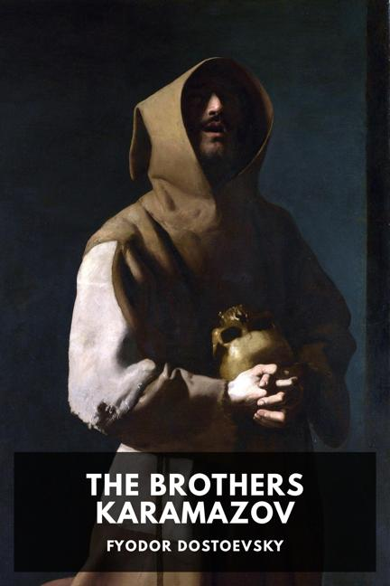

## What's Going On

I am a 17 year old high school senior living in Fremont, California. I go to school at [RISE Academy](https://www.riseacademy.education/) and am currently trying to get into a top university for Biochemistry. I have been an officer member of Student Council for the past 2 years, and am Class President this year.

I am also enrolled at [Foothill College](https://www.foothill.edu/) and take a class nearly every semester. I plan to take General Chemistry or Statistics in the Winter or Spring.

## What I'm Reading

I am currently reading [_The Brothers Karamazov_](https://en.wikipedia.org/wiki/The_Brothers_Karamazov) by Fyodor Dostoevsky. The last book I read was [_The Road_](https://en.wikipedia.org/wiki/The_Road) by Cormac McCarthy. I have been into Russian literature lately, and plan to read [_Cancer Ward_](https://en.wikipedia.org/wiki/Cancer_Ward) or [_The Master and Margarita_](https://en.wikipedia.org/wiki/The_Master_and_Margarita) next.

